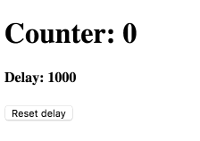

# JavaScript执行上下文与闭包作业

## 第一题：整理PPT中出现的概念，并写出对这些概念的理解。

## 第二题：运行PPT中的代码，理解JS解释器执行代码的过程。

## 第三题：问答题。

1. 闭包是什么时候创建的？
2. 函数执行上下文是什么时候创建的？
3. 函数执行上下文是什么时候销毁的？
4. 全局执行上下文会被销毁么？
5. 函数执行的二阶段是什么？
6. 函数执行上下文中包含什么重要信息？
7. 画一下执行上下文的创建与销毁的过程。
8. 执行代码时，是如何找到代码中的变量的？

## 第四题：看看下面的useCallback是否使用正确。如果有问题，请说明你的判断依据，并修复之。

```tsx
import React, { useState, useCallback, useEffect } from 'react';
function Demo() {
  const [users, setUsers] = useState([]);

  const addUsers = useCallback((user) => {
    setUsers([..users, user]);
  }, []);

  useEffect(() => {
    fetch('/users').then(response => response.json()).then(response => {
      setUsers(response);
    });
  }, []);

  return <div>
    <UserList users={users} />
    <AddUserForm handleAdd={addUsers} />
  </div>;
}
```

## 第五题：解释一下`useEffect`、`useCallback`、`useMemo`的第二个参数的主要作用，并尝试找出一些共性。

## 第六题：使用 React Hooks 声明 setInterval。

使用方式如下：

```tsx
function Counter() {
  const [delay, setDelay] = useState(1000);
  const [count, setCount] = useState(0);

  // Increment the counter.
  useInterval(() => {
    setCount(count + 1);
  }, delay);

  // Make it faster every second!
  useInterval(() => {
    if (delay > 10) {
      setDelay(delay / 2);
    }
  }, 1000);

  function handleReset() {
    setDelay(1000);
  }

  return (
    <>
      <h1>Counter: {count}</h1>
      <h4>Delay: {delay}</h4>
      <button onClick={handleReset}>
        Reset delay
      </button>
    </>
  );
}
```

效果图如下：

