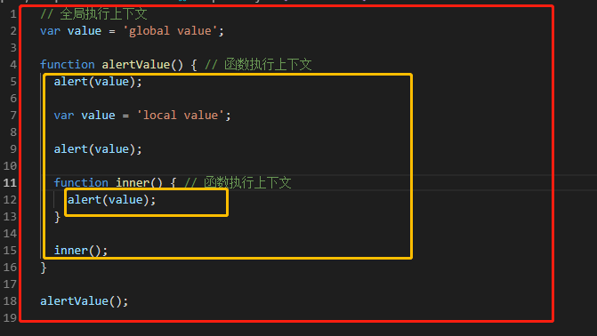
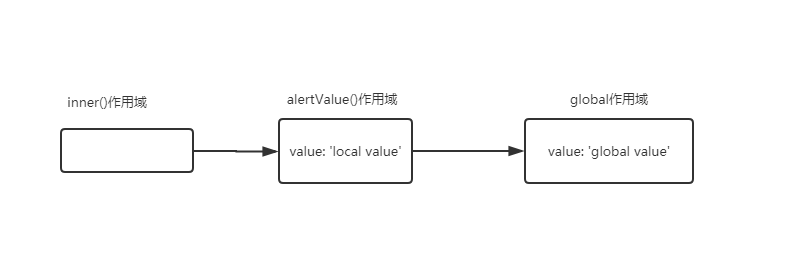
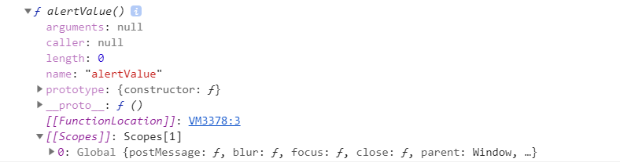
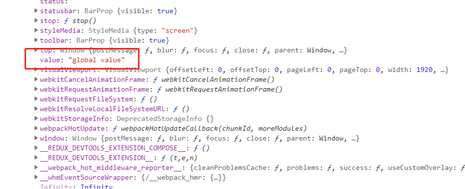
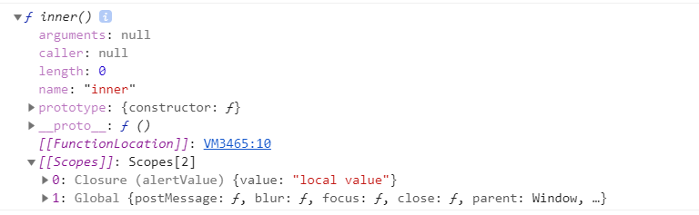
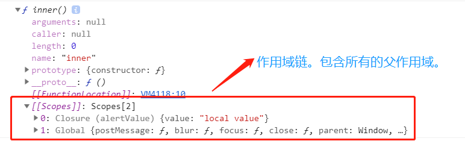

import { CodeSurferLayout } from 'code-surfer';
import { Appear } from 'mdx-deck';
export { nightOwlFull as theme } from 'code-surfer/themes';

# JavaScript 执行上下文和闭包

---

<CodeSurferLayout>

```js title="这段代码的执行结果是什么？"
var value = 'global value';
function alertValue() {
  alert(value);
  var value = 'local value';
  alert(value);
}
alertValue();
```

```js 4 subtitle="弹出什么？"
var value = 'global value';

function alertValue() {
  alert(value);

  var value = 'local value';

  alert(value);
}

alertValue();
```

```js 4 subtitle="弹出undefined"
var value = 'global value';

function alertValue() {
  alert(value);

  var value = 'local value';

  alert(value);
}

alertValue();
```

```js 8 subtitle="弹出什么？"
var value = 'global value';

function alertValue() {
  alert(value);

  var value = 'local value';

  alert(value);
}

alertValue();
```

```js 8 subtitle="弹出local value"
var value = 'global value';

function alertValue() {
  alert(value);

  var value = 'local value';

  alert(value);
}

alertValue();
```

</CodeSurferLayout>

---

为什么第四行代码`alert(value)`会弹出`undefined`呢？

---

<CodeSurferLayout>

```js 0 subtitle="JS解释器在执行任何代码之前创建全局执行上下文（global execution context）。"
var value = 'global value';

function alertValue() {
  alert(value);

  var value = 'local value';

  alert(value);
}

alertValue();
```

```js 1 subtitle="定义了全局变量value，并放入全局执行上下文。"
var value = 'global value';

function alertValue() {
  alert(value);

  var value = 'local value';

  alert(value);
}

alertValue();
```

```js 3:9 subtitle="JS解释器遇到函数，会创建函数执行上下文（function execution context）。"
var value = 'global value';

function alertValue() {
  alert(value);

  var value = 'local value';

  alert(value);
}

alertValue();
```

```js 3:9 subtitle="JS解释器在执行函数时，分成两个阶段。"
var value = 'global value';

function alertValue() {
  alert(value);

  var value = 'local value';

  alert(value);
}

alertValue();
```

```js 3,9 subtitle="阶段一：创建阶段。执行函数中的代码之前的阶段。JS解释器会做一些准备工作。"
var value = 'global value';

function alertValue() {
  alert(value);

  var value = 'local value';

  alert(value);
}

alertValue();
```

```js 3,9 subtitle="1. 创建作用域链（scope chain），可以引用到父作用域。"
var value = 'global value';

function alertValue() {
  alert(value);

  var value = 'local value';

  alert(value);
}

alertValue();
```

```js 3,6,9 subtitle="2. 创建函数参数、内部函数、变量。如这里的value变量。并放入到函数执行上下文。"
var value = 'global value';

function alertValue() {
  alert(value);

  var value = 'local value';

  alert(value);
}

alertValue();
```

```js 3,6,9 subtitle="重点：阶段一创建的变量，此时的值一律为undefined。"
var value = 'global value';

function alertValue() {
  alert(value);

  var value = 'local value';

  alert(value);
}

alertValue();
```

```js 3,9 subtitle="3. 处理this。"
var value = 'global value';

function alertValue() {
  alert(value);

  var value = 'local value';

  alert(value);
}

alertValue();
```

```js 4:8 subtitle="进入阶段二：一行一行执行代码。"
var value = 'global value';

function alertValue() {
  alert(value);

  var value = 'local value';

  alert(value);
}

alertValue();
```

```js 4 subtitle="弹出变量value。先从函数执行上下文中找变量value，如果没找到，则从作用域链中查找（也就是父作用域）。"
var value = 'global value';

function alertValue() {
  alert(value);

  var value = 'local value';

  alert(value);
}

alertValue();
```

```js 4 subtitle="从函数执行上下文中找到了变量value，此时value变量的值是undefined。"
var value = 'global value';

function alertValue() {
  alert(value);

  var value = 'local value';

  alert(value);
}

alertValue();
```

```js 6 subtitle="给变量value赋值为'local value'。以相同的规则查找到变量value。"
var value = 'global value';

function alertValue() {
  alert(value);

  var value = 'local value';

  alert(value);
}

alertValue();
```

```js 8 subtitle="弹出变量value。此时value指向的是函数执行上下文中的value变量，且此时的值为'local value'"
var value = 'global value';

function alertValue() {
  alert(value);

  var value = 'local value';

  alert(value);
}

alertValue();
```

</CodeSurferLayout>

---

## 重要概念

<ul>
  <Appear>
    <li>执行上下文</li>
    <li>作用域</li>
    <li>作用域链</li>
    <li>var变量、函数提升</li>
    <li>怎么查找到变量？</li>
    <li style={{ fontSize: 50 }}>最后，讲讲闭包</li>
  </Appear>
</ul>

---

## 执行上下文

execution context

有哪些执行上下文？

<ul>
  <Appear>
    <li>全局</li>
    <li>函数（又称之为本地）</li>
    <li>块（block）</li>
    <li>eval</li>
  </Appear>
</ul>

---

<CodeSurferLayout>

```js title="全局执行上下文"
var value = 'global value';

function alertValue() {
  alert(value);

  var value = 'local value';

  alert(value);

  function inner() {
    alert(value);
  }

  inner();
}

alertValue();
```

```js 1 title="创建value变量"
var value = 'global value';

function alertValue() {
  alert(value);

  var value = 'local value';

  alert(value);

  function inner() {
    alert(value);
  }

  inner();
}

alertValue();
```

```js 3,15 title="创建了alertValue函数"
var value = 'global value';

function alertValue() {
  alert(value);

  var value = 'local value';

  alert(value);

  function inner() {
    alert(value);
  }

  inner();
}

alertValue();
```

```js 17 title="执行alertValue函数"
var value = 'global value';

function alertValue() {
  alert(value);

  var value = 'local value';

  alert(value);

  function inner() {
    alert(value);
  }

  inner();
}

alertValue();
```

</CodeSurferLayout>

---

<CodeSurferLayout>

```js 3:15 title="alertValue函数执行上下文"
var value = 'global value';

function alertValue() {
  alert(value);

  var value = 'local value';

  alert(value);

  function inner() {
    alert(value);
  }

  inner();
}

alertValue();
```

```js 10:12 title="inner函数执行上下文"
var value = 'global value';

function alertValue() {
  alert(value);

  var value = 'local value';

  alert(value);

  function inner() {
    alert(value);
  }

  inner();
}

alertValue();
```

</CodeSurferLayout>

---



<ul>
  <Appear>
    <li>红色的区域是全局执行上下文</li>
    <li>只能有一个全局执行上下文</li>
    <li>两个黄色框是两个函数执行上下文</li>
    <li>只要调用一次函数，就创建了一个函数执行上下文</li>
    <li>所以，可以有无数个函数执行上下文</li>
  </Appear>
</ul>

---

### JS 解释器是怎么执行一段代码的？

两阶段：

- 阶段一：创建阶段。创建的是执行上下文。
  - 创建作用域链
  - 创建 var 变量、内部函数、函数入参
  - 准备**this**
- 阶段二：一行一行执行代码。

---

### var 变量、函数提升

JS 解释器执行代码的过程，会带来一个很让人费解的现象：

**可以在 var 变量、函数定义之前使用 var 变量和函数；**

**在 var 变量之前使用 var 变量，变量值是 undefined。**

---

### ES6 看不惯 var 变量提升

**let**和**const**就横空出世啦！

通过**let**和**const**定义的变量不参与到创建阶段。

---

<CodeSurferLayout>

```js
alert(value);

let value = '123';
```

```js 1 subtitle="报错：Uncaught ReferenceError: value is not defined"
alert(value);

let value = '123';
```

</CodeSurferLayout>

---

### ES6 的新东西：块作用域

使用**{}**就可以定义一个块作用域。

- var 变量是跨块级作用域的。
- let, const 变量只能在快作用域中使用。

---

<CodeSurferLayout>

```js
{
  let value = 0;
  console.log(value);
}
console.log(value);
```

```js 1:4 subtitle="创建块作用域"
{
  let value = 0;
  console.log(value);
}
console.log(value);
```

```js 3 subtitle="输出0"
{
  let value = 0;
  console.log(value);
}
console.log(value);
```

```js 5 subtitle="Uncaught ReferenceError: value is not defined"
{
  let value = 0;
  console.log(value);
}
console.log(value);
```

</CodeSurferLayout>

---

<CodeSurferLayout>

```js
{
  var value = 0;
  console.log(value);
}
console.log(value);
```

```js 1:4 subtitle="创建块作用域"
{
  var value = 0;
  console.log(value);
}
console.log(value);
```

```js 3 subtitle="输出0"
{
  var value = 0;
  console.log(value);
}
console.log(value);
```

```js 5 subtitle="输出0"
{
  var value = 0;
  console.log(value);
}
console.log(value);
```

</CodeSurferLayout>

---

`if`、`for`、`while`、`do`这些带有**{}**的语句都会创建块作用域。

---

### 执行上下文之间是什么关系？

<Appear>
  <div>
    如果从词法上看代码之间是嵌套关系，则相对应的执行上下文就是链接关系。
  </div>
  <div>子执行上下文的代码可以访问到父执行上下文的变量、函数等。</div>
  <div>新名词：词法作用域 （lexture scope）。</div>
  <div>执行上下文栈 execution context stack</div>
</Appear>

---

### 执行上下文中有什么东西？

执行上下文就是一个 JavaScript 对象，其中有三个最重要的属性：

<ul>
  <Appear>
    <li> scopeChain - 作用域链</li>
    <div style={{ paddingLeft: '2em' }}>
      包含自身的variableObject和所有父执行上下文中的variableObject
    </div>
    <li>variableObject - 变量对象：包括函数入参、内部变量、内部函数定义</li>
    <li>this</li>
  </Appear>
</ul>

---

### 作用域约等于 variableObject

---

### 作用域链长什么样？

作用域链类似链表的一个结构：



---

### 为什么要有作用域链？

<Appear>
  <div>为了在执行代码时，查找到变量。</div>
</Appear>

---

### 怎么查找到变量？

<Appear>
  <div>沿着作用域链从自身作用域往上查找，一直到全局作用域。</div>
</Appear>

---

### 窥探一下 Chrome 浏览器是如何创建作用域链的？

以`alertValue`和`inner`函数为例。

**console.dir(fn)**会输出更详细的函数信息，包括一些解释器信息。

---

### console.dir(alertValue)



展开 global scope，发现：



---

### console.dir(inner)



---

### console.dir(inner)



---

### 小结

Chrome 在创建函数时，会将当前执行上下文的作用域链与这个函数实例进行绑定。

<Appear>
  <p>这样，在调用这个函数时，在“创建阶段”，就很容易构建出作用域链。</p>
  <p style={{ padding: '0 2em' }}>
    这种在创建函数时绑定父执行上下文的作用域的行为，称之为“Closure”。也就是所谓的“闭包”。
  </p>
</Appear>

---

## 闭包

第一个定义：按照 Chrome 的说法，在创建函数时绑定父执行上下文的作用域的行为。

---

## 闭包

第二个定义：按照 MDN 的说法，闭包是函数和声明该函数的词法环境的组合。

**这个环境包括了这个闭包创建时所能访问的所有局部变量。**

---

## 闭包

第三个定义：闭包是一种能够在函数声明过程中将环境信息与所属函数绑定在一起的数据结构。

<Appear>
  <div>
    它是基于函数声明的文本位置的，因此也被称为围绕函数定义的
    <strong>静态作用域</strong>或<strong>词法作用域</strong>。
  </div>
</Appear>

---

## 闭包本质论

从本质上讲，闭包就是函数继承而来的作用域。这类似于对象方法时如何访问其继承的实例变量的，它们都具有其父类型的引用。

是对**变量的引用**。

---

应用所学的知识思考一个问题。

---

<CodeSurferLayout>

```js title="会输出什么？"
for (var i = 0; i < 100; i++) {
  setTimeout(() => {
    console.log(i);
  }, 25);
}
```

```js 3 subtitle="输出100个100。"
for (var i = 0; i < 100; i++) {
  setTimeout(() => {
    console.log(i);
  }, 25);
}
```

```js 1:4 title="会输出什么？"
for (let i = 0; i < 100; i++) {
  setTimeout(() => {
    console.log(i);
  }, 25);
}
```

```js 3 title="会输出0, 1, 2, ..., 99"
for (let i = 0; i < 100; i++) {
  setTimeout(() => {
    console.log(i);
  }, 25);
}
```

</CodeSurferLayout>

---

为什么呢？:sunglasses:

---

谢谢！！！！

:clap::clap::clap:

🎉🎉🎉
